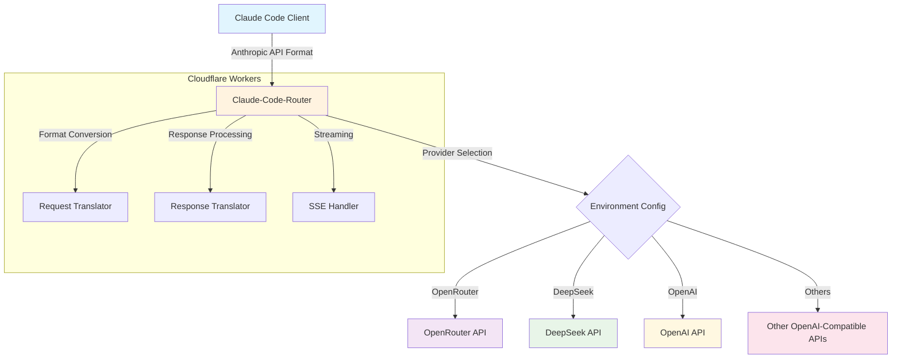
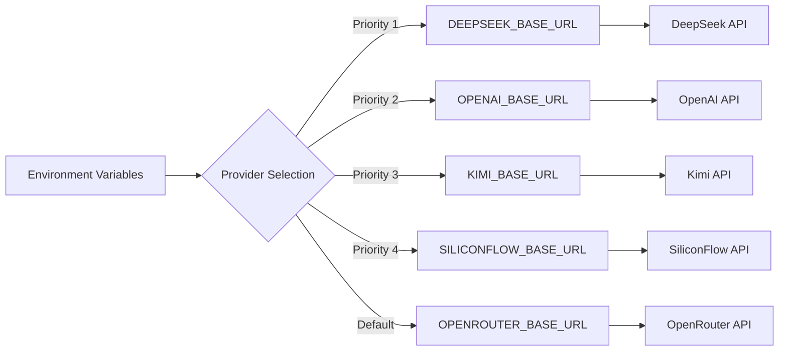
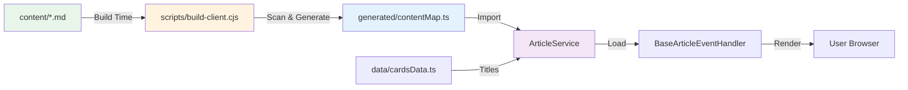

# AI Speeds - Make AI Speeds Us and Provide Universal Claude API Proxy

**AI
Speeds**是一个AI 产品自我展示和AI生成内容聚合平台，服务于希望发现和体验AI能力的专业人士与学习者。我们让AI 产品以Agent身份自我介绍、展示能力，并生成实际应用案例，用户可以直接体验AI工具的真实价值。

## ✨ Features

- **🔄 API Translation**: Anthropic ↔ OpenAI format conversion
- **🌍 Multi-Provider**: OpenRouter, OpenAI, DeepSeek, Kimi, SiliconFlow
- **⚡ Edge Computing**: Next.js Edge Runtime + Cloudflare Workers
- **📡 Streaming Support**: Real-time response streaming

## 🚀 Quick Start

### 1. Install Claude Code

```bash
pnpm add -g @anthropic-ai/claude-code
```

### 2. Configure API Access

```bash
# Option A: Use shared instance (testing only)
export ANTHROPIC_BASE_URL="https://aispeeds.me"
export ANTHROPIC_API_KEY="your-provider-api-key"

# Option B: Deploy your own instance (recommended)
git clone https://github.com/your-username/ai-speeds
cd ai-speeds && wrangler deploy
export ANTHROPIC_BASE_URL="https://your-domain.workers.dev"
```

### 3. Start Using Claude Code

```bash
source ~/.bashrc && claude
```

### Provider Setup

| Provider   | API Key Source                                         | Base URL                        |
| ---------- | ------------------------------------------------------ | ------------------------------- |
| OpenRouter | [openrouter.ai](https://openrouter.ai)                 | `https://aispeeds.me`           |
| DeepSeek   | [platform.deepseek.com](https://platform.deepseek.com) | Deploy with `DEEPSEEK_BASE_URL` |
| OpenAI     | [platform.openai.com](https://platform.openai.com)     | Deploy with `OPENAI_BASE_URL`   |

## 🏗️ Architecture



## ⚡ Technical Stack

### Core Runtime

- **Framework**: Next.js 15 with App Router
- **Frontend**: React 19 + Tailwind CSS 3
- **Platform**: Cloudflare Workers via OpenNext
- **Language**: TypeScript with strict typing
- **Runtime**: Edge Runtime (V8 Isolates)
- **Deployment**: OpenNext Cloudflare + Wrangler CLI

### Architecture Patterns

| Pattern            | Implementation           | Benefit                         |
| ------------------ | ------------------------ | ------------------------------- |
| **Edge Computing** | 300+ global locations    | <1ms cold start, 0ms warm start |
| **React Server**   | Next.js App Router       | SEO-friendly, fast page loads   |
| **Type Safety**    | Full TypeScript coverage | Runtime error prevention        |
| **Streaming**      | Web Streams API + SSE    | Real-time response delivery     |
| **Modular Design** | React components         | Easy testing & maintenance      |

### Build System

- **Framework**: Next.js 15 with Turbopack
- **Bundler**: esbuild for client modules
- **Module System**: ES6 with tree-shaking
- **Content Pipeline**: SSOT markdown loader (auto-generated)
- **Asset Pipeline**: TypeScript → JavaScript + type checking
- **Hot Reload**: Next.js dev server with instant updates

## 🔧 Deployment

### Development

```bash
git clone https://github.com/your-username/ai-speeds
cd ai-speeds
pnpm install

# Build client modules (generates SSOT content maps)
pnpm run build:client    # Required before first run

# Next.js Development (Recommended)
pnpm run dev:next        # Start Next.js dev server (http://localhost:3000)

# Legacy Workers Development
pnpm run dev             # Start Wrangler dev server
```

### Production Deployment

#### Option 1: Cloudflare Workers (Next.js)

```bash
# Build Next.js for Cloudflare
pnpm run cf:build        # Build with OpenNext Cloudflare

# Preview locally
pnpm run cf:preview      # Test before deployment

# Deploy to Cloudflare
pnpm run cf:deploy       # Deploy to production
```

#### Option 2: Traditional Deployment

```bash
# Configure environment variables
wrangler secret put OPENROUTER_BASE_URL       # OpenRouter backend
wrangler secret put DEEPSEEK_BASE_URL         # DeepSeek backend
wrangler secret put OPENAI_BASE_URL           # OpenAI backend

# Deploy to Cloudflare Workers
pnpm run deploy
```

### Environment Configuration



## 🔌 API Reference

### Request Format (Anthropic)

```bash
curl -X POST https://aispeeds/v1/messages \
  -H "Content-Type: application/json" \
  -H "x-api-key: your-api-key" \
  -d '{
    "model": "claude-3-5-sonnet-20241022",
    "messages": [{"role": "user", "content": "Hello"}],
    "max_tokens": 100,
    "stream": true
  }'
```

### Model Mapping

| Claude Model                 | OpenRouter                    | DeepSeek            | OpenAI        |
| ---------------------------- | ----------------------------- | ------------------- | ------------- |
| `claude-3-5-haiku-20241022`  | `anthropic/claude-3.5-haiku`  | `deepseek-chat`     | `gpt-4o-mini` |
| `claude-3-5-sonnet-20241022` | `anthropic/claude-3.5-sonnet` | `deepseek-chat`     | `gpt-4o`      |
| `claude-3-opus-20240229`     | `anthropic/claude-3-opus`     | `deepseek-reasoner` | `gpt-4o`      |

## 📁 Architecture & Structure

### Worker Runtime Architecture

```
┌─────────────────────────────────────────────────────────────────┐
│                        Cloudflare Workers                        │
├─────────────────────────────────────────────────────────────────┤
│ 🔄 Request Router    │ 🔄 Format Converter │ 📡 Stream Handler  │
│ • Path matching       │ • Anthropic → OpenAI  │ • SSE processing    │
│ • Method validation   │ • OpenAI → Anthropic  │ • Chunk buffering   │
│ • Auth handling       │ • Model mapping      │ • Error recovery    │
└─────────────────────────────────────────────────────────────────┘
```

### File Structure & Frontend Architecture

```
ai-speeds/
├── 📁 src/
│   ├── 📁 app/                  # Next.js App Router ⭐
│   │   ├── 📁 (main)/home/       # 主页路由组
│   │   │   └── 📁 page.tsx        # 主页 (使用适配器)
│   │   ├── 📁 api/               # HTTP API 路由 (Controller 层)
│   │   │   ├── 📁 v1/messages/    # Claude API 代理
│   │   │   │   └── 📁 route.ts     # POST /api/v1/messages
│   │   │   └── 📁 img-proxy/      # 图片代理
│   │   │       └── 📁 route.ts     # GET /api/img-proxy
│   │   ├── 📁 layout.tsx         # 根布局
│   │   ├── 📁 page.tsx           # 根路由 (重定向)
│   │   └── 📁 globals.css        # 全局样式
│   ├── 📁 components/          # React 组件 (新架构) ⭐
│   │   ├── 📁 LegacyPageWrapper.tsx # 适配器组件
│   │   ├── 📁 BrandIcon.tsx    # 品牌图标
│   │   └── 📁 ui/              # shadcn/ui 组件
│   ├── 📁 services/            # 业务服务层 (Service 层) ⭐
│   │   └── 📁 llm-provider/    # LLM 供应商服务
│   │       ├── 📁 adapters/    # 格式转换、流处理
│   │       │   ├── 📁 format.ts # Anthropic ↔ OpenAI 转换
│   │       │   └── 📁 stream.ts # 流式响应处理
│   │       ├── 📁 types.ts     # 类型定义
│   │       └── 📁 providers.ts # 供应商配置
│   ├── 📁 lib/                 # 工具函数 (Utility 层)
│   │   ├── 📁 utils/           # 通用工具
│   │   └── 📁 config/          # 配置文件
│   ├── 📁 config/              # 全局配置
│   ├── 📁 types/               # 类型定义
│   └── 📁 legacy/              # 旧代码隔离区 📦
│       ├── 📁 components/     # 旧布局组件
│       ├── 📁 features/       # 旧功能模块
│       │   ├── 📁 get-started/
│       │   ├── 📁 best-practices/
│       │   ├── 📁 how-to-implement/
│       │   └── 📁 how-to-apply-cc/
│       ├── 📁 client/         # 旧客户端代码
│       │   ├── 📁 bestPractices/
│       │   ├── 📁 howToApplyCC/
│       │   ├── 📁 howToImplement/
│       │   └── 📁 shared/
│       ├── 📁 styles/         # 旧样式系统
│       └── 📁 scripts/        # 旧脚本系统
├── 📁 scripts/                  # 构建自动化 ⭐
│   ├── 📁 build-client.cjs       # Legacy 客户端模块打包
│   ├── 📁 build-client-safe.cjs  # 带缓存的安全构建
│   └── 📁 migrate-to-legacy.sh   # Legacy 代码隔离脚本
├── 📁 docs/                    # 项目文档
│   ├── 📁 SRC_ARCHITECTURE.md    # 架构说明
│   ├── 📁 LEGACY_ISOLATION_GUIDE.md # 隔离指南
│   └── 📁 QUICK_START_NEW_DEV.md # 新手快速开始
├── 🔧 next.config.mjs           # Next.js 配置
├── 🔧 open-next.config.ts       # OpenNext Cloudflare 配置
└── ⚙️ wrangler.toml             # Cloudflare 配置
```

### Frontend Build Architecture

The project uses a **hybrid architecture** combining Next.js and legacy modules:

#### Next.js Layer (Primary)

- **Framework**: Next.js 15 with App Router
- **Components**: React 19 components
- **Styling**: Tailwind CSS 3
- **API Routes**: Edge Runtime handlers
- **Benefits**: Modern React, SEO-friendly, type-safe

#### Three-Layer Architecture (v1.1.0+)

The project follows a clean **three-layer architecture**:

```
┌─────────────────────────────────────┐
│   app/api/v1/messages/route.ts     │  Controller Layer
│   (HTTP request/response handling)  │
└──────────────┬──────────────────────┘
               │ calls
               ↓
┌─────────────────────────────────────┐
│   services/llm-provider/            │  Service Layer
│   (business logic, format conversion)│
└──────────────┬──────────────────────┘
               │ uses
               ↓
┌─────────────────────────────────────┐
│   lib/ (utilities)                  │  Utility Layer
│   config/ (configuration)           │
└─────────────────────────────────────┘
```

**Benefits:**

- ✅ Clear separation of concerns
- ✅ Easy to test and maintain
- ✅ Follows industry best practices
- ✅ Easy to extend with new services

#### Legacy Code Isolation (v1.1.0+)

All legacy code has been moved to `src/legacy/`:

- **Purpose**: Complete isolation of old code from new development
- **Implementation**: `LegacyPageWrapper` adapter component
- **Architecture**: Adapter pattern for seamless integration
- **Benefits**: Clean codebase, zero migration risk, 100% functionality
  preserved

**Migration Progress:**

- ✅ **v1.1.0**: Legacy isolation + Service layer refactoring
- ✅ **v1.0.0**: Next.js + Adapter pattern
- 🔄 **Future**: Gradual React component migration
- 🎯 **Goal**: Pure Next.js architecture

### Key Design Principles

- **🌐 Edge-First**: Optimized for Cloudflare's global network
- **⚛️ React Modern**: Next.js 15 + React 19 architecture
- **⚡ Performance**: Sub-millisecond response times
- **🔄 Streaming**: Native Web Streams API + SSE support
- **🛡️ Type Safety**: Full TypeScript coverage with strict mode
- **♻️ Code Reuse**: 100% legacy code reuse via adapter pattern
- **📝 SSOT Content**: Build-time generated markdown loaders (zero maintenance)

## 📝 Content Management (SSOT)

### Architecture

The project uses a **Single Source of Truth (SSOT)** architecture for markdown
content:



### Key Features

- **Zero Maintenance**: Add new articles by creating `.md` files and updating
  `cardsData.ts`
- **Build-Time Generation**: Content maps auto-generated from filesystem
- **Type Safety**: Full TypeScript support for content loaders
- **DRY Principle**: Titles defined once in `cardsData.ts`
- **Validation**: Build-time checks for missing files or orphaned content

### Adding New Content

```bash
# 1. Create markdown file (kebab-case)
touch src/client/bestPractices/content/new-practice.md

# 2. Add card metadata
# Edit src/client/bestPractices/data/cardsData.ts
export const bestPracticesCards = [
  {
    id: 'new-practice',  // Must match filename
    title: 'New Practice',
    category: 'workflow',
    // ...
  },
];

# 3. Rebuild (auto-generates contentMap.ts)
pnpm run build:client

# 4. Done! No service code changes needed
```

### Technical Details

For complete architecture documentation, see:

- [`docs/tech/SSOT_CONTENT_MAP_REFACTOR.md`](./docs/tech/SSOT_CONTENT_MAP_REFACTOR.md) -
  SSOT architecture
- [`docs/tech/ADD_CARD.md`](./docs/tech/ADD_CARD.md) - Step-by-step guide

## 📦 Migration to Next.js

### Why Next.js?

- ✅ **Modern Stack**: React 19, Tailwind CSS, TypeScript
- ✅ **SEO Friendly**: Server-side rendering support
- ✅ **Developer Experience**: Hot reload, type safety, modern tooling
- ✅ **Edge Runtime**: Compatible with Cloudflare Workers
- ✅ **Future Ready**: Easy to extend with React ecosystem

### Migration Highlights

- **100% Code Reuse**: All business logic preserved
- **Zero Downtime**: Gradual migration strategy
- **Minimal Changes**: Only ~600 lines of adapter code added
- **Performance**: Maintained edge runtime performance
- **Type Safety**: Enhanced TypeScript strict mode

### Migration Documentation

For detailed migration information, see:

- [`MIGRATION_FINAL_SUMMARY.md`](./MIGRATION_FINAL_SUMMARY.md) - Complete
  migration summary
- [`MIGRATION_PROGRESS.md`](./MIGRATION_PROGRESS.md) - Step-by-step progress
- [`UPGRADE_TO_NEXT_ARCHITECTURE.md`](./UPGRADE_TO_NEXT_ARCHITECTURE.md) -
  Architecture guide

## 🙏 Acknowledgments

Built with inspiration from:

- [claude-code-router](https://github.com/musistudio/claude-code-router)
- [claude-code-proxy](https://github.com/kiyo-e/claude-code-proxy)

## ⚖️ License & Disclaimer

**MIT License** - Use at your own risk and discretion.

⚠️ **Important**: This is an independent tool, not affiliated with Anthropic,
OpenAI, or OpenRouter. Users are responsible for compliance with all relevant
Terms of Service and API usage policies.
