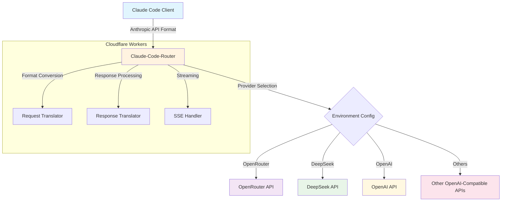
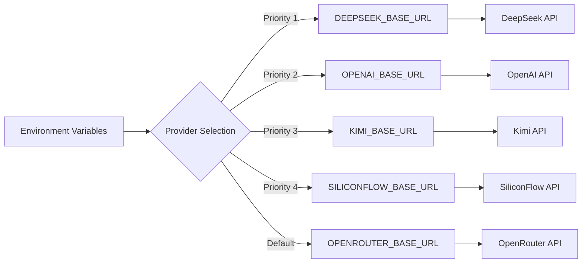
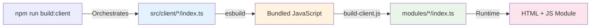

# Claude-Code-Router

Universal API proxy for using Claude Code with multiple AI providers. Seamlessly
translates between Anthropic's Claude API and OpenAI-compatible APIs.

## ✨ Features

- **🔄 API Translation**: Anthropic ↔ OpenAI format conversion
- **🌍 Multi-Provider**: OpenRouter, OpenAI, DeepSeek, Kimi, SiliconFlow
- **⚡ Edge Computing**: Cloudflare Workers for global performance
- **📡 Streaming Support**: Real-time response streaming
- **🛡️ Type Safety**: Full TypeScript implementation

## 🚀 Quick Start

### 1. Install Claude Code

```bash
pnpm add -g @anthropic-ai/claude-code
```

### 2. Configure API Access

```bash
# Option A: Use shared instance (testing only)
export ANTHROPIC_BASE_URL="https://cc.xiaohui.cool"
export ANTHROPIC_API_KEY="your-provider-api-key"

# Option B: Deploy your own instance (recommended)
git clone https://github.com/your-username/claude-code-router
cd claude-code-router && wrangler deploy
export ANTHROPIC_BASE_URL="https://your-domain.workers.dev"
```

### 3. Start Using Claude Code

```bash
source ~/.bashrc && claude
```

### Provider Setup

| Provider   | API Key Source                                         | Base URL                        |
| ---------- | ------------------------------------------------------ | ------------------------------- |
| OpenRouter | [openrouter.ai](https://openrouter.ai)                 | `https://cc.xiaohui.cool`       |
| DeepSeek   | [platform.deepseek.com](https://platform.deepseek.com) | Deploy with `DEEPSEEK_BASE_URL` |
| OpenAI     | [platform.openai.com](https://platform.openai.com)     | Deploy with `OPENAI_BASE_URL`   |

## 🏗️ Architecture



## ⚡ Technical Stack

### Core Runtime

- **Platform**: Cloudflare Workers (V8 Isolates)
- **Language**: TypeScript with strict typing
- **Runtime**: Edge-optimized JavaScript (no Node.js dependencies)
- **Deployment**: Wrangler CLI + GitHub Actions

### Architecture Patterns

| Pattern            | Implementation           | Benefit                         |
| ------------------ | ------------------------ | ------------------------------- |
| **Edge Computing** | 300+ global locations    | <1ms cold start, 0ms warm start |
| **Serverless**     | Auto-scaling isolates    | 0 maintenance, infinite scale   |
| **Type Safety**    | Full TypeScript coverage | Runtime error prevention        |
| **Streaming**      | Web Streams API          | Real-time response delivery     |
| **Modular Design** | Functional composition   | Easy testing & maintenance      |

### Build System

- **Bundler**: esbuild (10x faster than webpack)
- **Module System**: ES6 with tree-shaking
- **Asset Pipeline**: TypeScript → JavaScript + type checking
- **Hot Reload**: Wrangler dev server with instant updates

## 🔧 Deployment

### Development

```bash
git clone https://github.com/your-username/claude-code-router
cd claude-code-router
pnpm install && pnpm add -g wrangler
pnpm run build:client    # Build frontend modules
pnpm run dev             # Start development server
```

### Production Deployment

```bash
# Configure environment variables
wrangler secret put OPENROUTER_BASE_URL       # OpenRouter backend
wrangler secret put DEEPSEEK_BASE_URL         # DeepSeek backend
wrangler secret put OPENAI_BASE_URL           # OpenAI backend

# Deploy to Cloudflare Workers
pnpm run deploy
```

### Environment Configuration



## 🔌 API Reference

### Request Format (Anthropic)

```bash
curl -X POST https://cc.xiaohui.cool/v1/messages \
  -H "Content-Type: application/json" \
  -H "x-api-key: your-api-key" \
  -d '{
    "model": "claude-3-5-sonnet-20241022",
    "messages": [{"role": "user", "content": "Hello"}],
    "max_tokens": 100,
    "stream": true
  }'
```

### Model Mapping

| Claude Model                 | OpenRouter                    | DeepSeek            | OpenAI        |
| ---------------------------- | ----------------------------- | ------------------- | ------------- |
| `claude-3-5-haiku-20241022`  | `anthropic/claude-3.5-haiku`  | `deepseek-chat`     | `gpt-4o-mini` |
| `claude-3-5-sonnet-20241022` | `anthropic/claude-3.5-sonnet` | `deepseek-chat`     | `gpt-4o`      |
| `claude-3-opus-20240229`     | `anthropic/claude-3-opus`     | `deepseek-reasoner` | `gpt-4o`      |

## 📁 Architecture & Structure

### Worker Runtime Architecture

```
┌─────────────────────────────────────────────────────────────────┐
│                        Cloudflare Workers                        │
├─────────────────────────────────────────────────────────────────┤
│ 🔄 Request Router    │ 🔄 Format Converter │ 📡 Stream Handler  │
│ • Path matching       │ • Anthropic → OpenAI  │ • SSE processing    │
│ • Method validation   │ • OpenAI → Anthropic  │ • Chunk buffering   │
│ • Auth handling       │ • Model mapping      │ • Error recovery    │
└─────────────────────────────────────────────────────────────────┘
```

### File Structure & Frontend Architecture

```
claude-code-router/
├── 📁 src/
│   ├── 📁 api/                 # API 适配器和类型定义
│   │   ├── 📁 adapters/         # 请求和响应格式转换
│   │   │   ├── 📁 format.ts      # 请求/响应格式化
│   │   │   └── 📁 stream.ts      # 流处理
│   │   ├── 📁 types.ts          # API 类型定义
│   │   └── 📁 providers.ts      # 供应商配置
│   ├── 📁 client/              # 前端和文档系统 (TypeScript 源码)
│   │   ├── 📁 bestPractices/    # 最佳实践模块 (开发源码)
│   │   │   ├── 📁 core/          # 管理器和业务逻辑
│   │   │   ├── 📁 data/          # 卡片数据和配置
│   │   │   ├── 📁 renderers/     # UI 渲染组件
│   │   │   ├── 📁 services/      # 内容和 Markdown 服务
│   │   │   └── 📁 index.ts       # 模块入口点
│   │   ├── 📁 howToApplyCC/     # 如何使用 CC 模块
│   │   │   ├── 📁 components/    # UI 组件
│   │   │   ├── 📁 services/      # 服务层
│   │   │   └── 📁 index.ts       # 模块入口点
│   │   └── 📁 howToImplement/   # 实现指南模块 (开发源码)
│   │       ├── 📁 core/          # HowToImplementManager
│   │       ├── 📁 data/          # 卡片数据和配置
│   │       ├── 📁 handlers/      # 事件处理
│   │       ├── 📁 renderers/     # UI 渲染组件
│   │       ├── 📁 services/      # 内容服务
│   │       └── 📁 index.ts       # 模块入口点
│   ├── 📁 components/           # 共享 UI 组件
│   ├── 📁 config/               # 全局配置
│   ├── 📁 server/               # 服务器运行时逻辑
│   │   ├── 📁 env.ts             # 环境变量类型定义
│   │   ├── 📁 index.ts           # 服务器入口点
│   │   └── 📁 routes/            # 路由处理器
│   │       └── 📁 imgProxy.ts     # 图片代理
│   ├── 📁 scripts/              # 客户端脚本
│   │   └── 📁 generated/         # 从 src/client/* 自动生成
│   ├── 📁 styles/               # 全局样式
│   ├── 📁 templates/            # HTML 模板
│   │   ├── 📁 components/        # 模板组件
│   │   │   └── 📁 favicon.ts      # 图标生成
│   │   ├── 📁 index.ts           # 主页模板
│   │   ├── 📁 terms.ts           # 服务条款页面
│   │   └── 📁 privacy.ts         # 隐私政策页面
│   └── 📁 utils/                # 工具函数
├── 📁 modules/                 # 静态 HTML 模板 + 编译后的 JavaScript
│   ├── 📁 best-practices/      # HTML 模板 + 打包的客户端代码
│   ├── 📁 get-started/         # 静态模块组件
│   ├── 📁 how-to-apply-cc/     # 如何使用 CC 模块
│   └── 📁 how-to-implement/    # HTML 模板 + 打包的客户端代码
├── 📁 scripts/                 # 构建自动化和打包
├── 🔧 index.ts                 # Worker 入口点 (fetch 处理器)
└── ⚙️ wrangler.toml            # Worker 配置和绑定
```

### Frontend Build Architecture

The project uses a **dual-layer frontend architecture**:

#### Development Layer (`src/client/`)

- **Purpose**: Modern TypeScript development with full module structure
- **Architecture**: Modular design (core, data, handlers, renderers, services)
- **Benefits**: Type safety, code organization, maintainability
- **Build Target**: Gets compiled and bundled by `scripts/build-client.js`

#### Runtime Layer (`modules/`)

- **Purpose**: Production-ready HTML templates + compiled JavaScript
- **Architecture**: Static HTML containers + bundled client code
- **Benefits**: Single-file deployment, optimized for Cloudflare Workers
- **Source**: Generated from development layer through build process

#### Build Process Flow



**Active Modules:**

- **Best Practices** (`src/client/bestPractices` → `modules/best-practices`)
- **How to Implement** (`src/client/howToImplement` →
  `modules/how-to-implement`)
- **How to Apply Claude Code** (`src/client/howToApplyCC` →
  `modules/how-to-apply-cc`)
- **Get Started** (Static components in `modules/get-started`)

This approach ensures **clean separation** between development complexity and
runtime efficiency.

### Key Design Principles

- **🌐 Edge-First**: Optimized for Cloudflare's global network
- **🔒 Zero Dependencies**: No external runtime dependencies
- **⚡ Performance**: Sub-millisecond response times
- **🔄 Streaming**: Native Web Streams API support
- **🛡️ Type Safety**: Full TypeScript coverage with strict mode

## 🙏 Acknowledgments

Built with inspiration from:

- [claude-code-router](https://github.com/musistudio/claude-code-router)
- [claude-code-proxy](https://github.com/kiyo-e/claude-code-proxy)

## ⚖️ License & Disclaimer

**MIT License** - Use at your own risk and discretion.

⚠️ **Important**: This is an independent tool, not affiliated with Anthropic,
OpenAI, or OpenRouter. Users are responsible for compliance with all relevant
Terms of Service and API usage policies.
