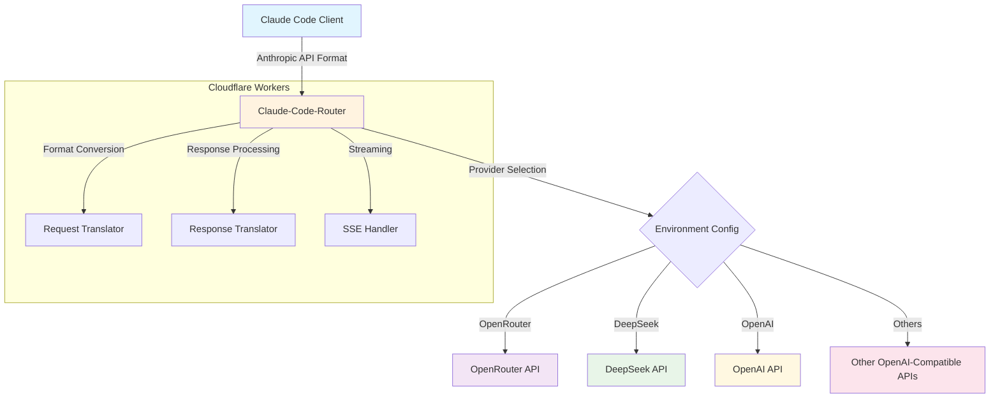
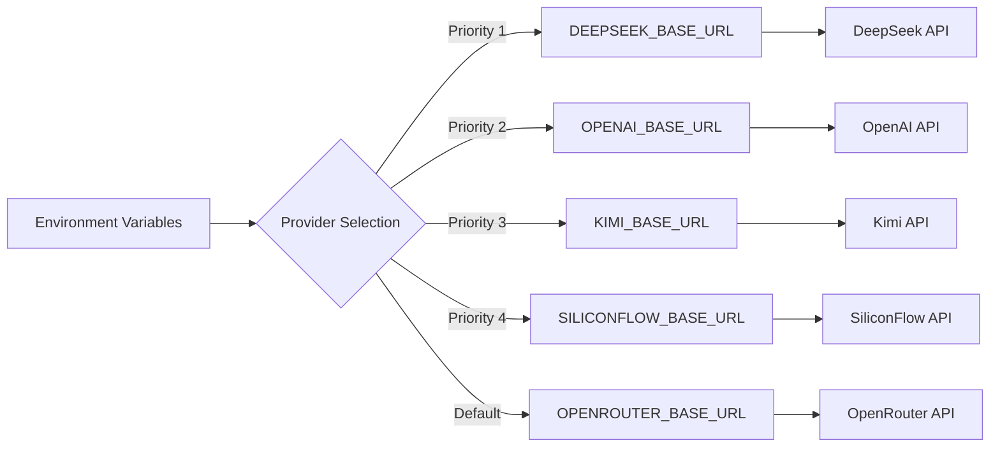
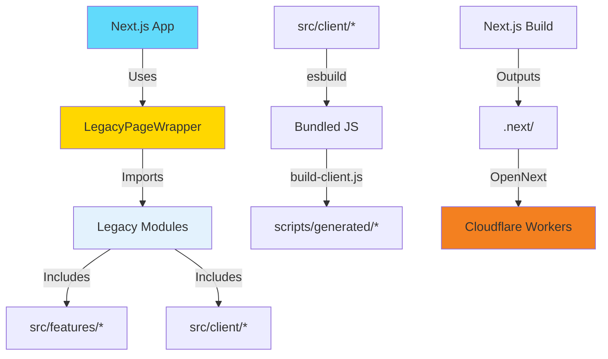

# Claude-Code-Router

Universal API proxy for using Claude Code with multiple AI providers. Seamlessly
translates between Anthropic's Claude API and OpenAI-compatible APIs.

## ✨ Features

- **🔄 API Translation**: Anthropic ↔ OpenAI format conversion
- **🌍 Multi-Provider**: OpenRouter, OpenAI, DeepSeek, Kimi, SiliconFlow
- **⚡ Edge Computing**: Next.js Edge Runtime + Cloudflare Workers
- **📡 Streaming Support**: Real-time response streaming

## 🚀 Quick Start

### 1. Install Claude Code

```bash
pnpm add -g @anthropic-ai/claude-code
```

### 2. Configure API Access

```bash
# Option A: Use shared instance (testing only)
export ANTHROPIC_BASE_URL="https://cc.xiaohui.cool"
export ANTHROPIC_API_KEY="your-provider-api-key"

# Option B: Deploy your own instance (recommended)
git clone https://github.com/your-username/claude-code-router
cd claude-code-router && wrangler deploy
export ANTHROPIC_BASE_URL="https://your-domain.workers.dev"
```

### 3. Start Using Claude Code

```bash
source ~/.bashrc && claude
```

### Provider Setup

| Provider   | API Key Source                                         | Base URL                        |
| ---------- | ------------------------------------------------------ | ------------------------------- |
| OpenRouter | [openrouter.ai](https://openrouter.ai)                 | `https://cc.xiaohui.cool`       |
| DeepSeek   | [platform.deepseek.com](https://platform.deepseek.com) | Deploy with `DEEPSEEK_BASE_URL` |
| OpenAI     | [platform.openai.com](https://platform.openai.com)     | Deploy with `OPENAI_BASE_URL`   |

## 🏗️ Architecture



## ⚡ Technical Stack

### Core Runtime

- **Framework**: Next.js 15 with App Router
- **Frontend**: React 19 + Tailwind CSS 3
- **Platform**: Cloudflare Workers via OpenNext
- **Language**: TypeScript with strict typing
- **Runtime**: Edge Runtime (V8 Isolates)
- **Deployment**: OpenNext Cloudflare + Wrangler CLI

### Architecture Patterns

| Pattern            | Implementation           | Benefit                         |
| ------------------ | ------------------------ | ------------------------------- |
| **Edge Computing** | 300+ global locations    | <1ms cold start, 0ms warm start |
| **React Server**   | Next.js App Router       | SEO-friendly, fast page loads   |
| **Type Safety**    | Full TypeScript coverage | Runtime error prevention        |
| **Streaming**      | Web Streams API + SSE    | Real-time response delivery     |
| **Modular Design** | React components         | Easy testing & maintenance      |

### Build System

- **Framework**: Next.js 15 with Turbopack
- **Bundler**: esbuild for client modules
- **Module System**: ES6 with tree-shaking
- **Asset Pipeline**: TypeScript → JavaScript + type checking
- **Hot Reload**: Next.js dev server with instant updates

## 🔧 Deployment

### Development

```bash
git clone https://github.com/your-username/claude-code-router
cd claude-code-router
pnpm install

# Next.js Development (Recommended)
pnpm run dev:next        # Start Next.js dev server (http://localhost:3000)

# Legacy Workers Development
pnpm run build:client    # Build frontend modules
pnpm run dev             # Start Wrangler dev server
```

### Production Deployment

#### Option 1: Cloudflare Workers (Next.js)

```bash
# Build Next.js for Cloudflare
pnpm run cf:build        # Build with OpenNext Cloudflare

# Preview locally
pnpm run cf:preview      # Test before deployment

# Deploy to Cloudflare
pnpm run cf:deploy       # Deploy to production
```

#### Option 2: Traditional Deployment

```bash
# Configure environment variables
wrangler secret put OPENROUTER_BASE_URL       # OpenRouter backend
wrangler secret put DEEPSEEK_BASE_URL         # DeepSeek backend
wrangler secret put OPENAI_BASE_URL           # OpenAI backend

# Deploy to Cloudflare Workers
pnpm run deploy
```

### Environment Configuration



## 🔌 API Reference

### Request Format (Anthropic)

```bash
curl -X POST https://cc.xiaohui.cool/v1/messages \
  -H "Content-Type: application/json" \
  -H "x-api-key: your-api-key" \
  -d '{
    "model": "claude-3-5-sonnet-20241022",
    "messages": [{"role": "user", "content": "Hello"}],
    "max_tokens": 100,
    "stream": true
  }'
```

### Model Mapping

| Claude Model                 | OpenRouter                    | DeepSeek            | OpenAI        |
| ---------------------------- | ----------------------------- | ------------------- | ------------- |
| `claude-3-5-haiku-20241022`  | `anthropic/claude-3.5-haiku`  | `deepseek-chat`     | `gpt-4o-mini` |
| `claude-3-5-sonnet-20241022` | `anthropic/claude-3.5-sonnet` | `deepseek-chat`     | `gpt-4o`      |
| `claude-3-opus-20240229`     | `anthropic/claude-3-opus`     | `deepseek-reasoner` | `gpt-4o`      |

## 📁 Architecture & Structure

### Worker Runtime Architecture

```
┌─────────────────────────────────────────────────────────────────┐
│                        Cloudflare Workers                        │
├─────────────────────────────────────────────────────────────────┤
│ 🔄 Request Router    │ 🔄 Format Converter │ 📡 Stream Handler  │
│ • Path matching       │ • Anthropic → OpenAI  │ • SSE processing    │
│ • Method validation   │ • OpenAI → Anthropic  │ • Chunk buffering   │
│ • Auth handling       │ • Model mapping      │ • Error recovery    │
└─────────────────────────────────────────────────────────────────┘
```

### File Structure & Frontend Architecture

```
claude-code-router/
├── 📁 src/
│   ├── 📁 app/                  # Next.js App Router ⭐
│   │   ├── 📁 (main)/home/       # 主页路由组
│   │   │   └── 📁 page.tsx        # 主页 (使用适配器)
│   │   ├── 📁 api/               # API 路由
│   │   │   ├── 📁 v1/messages/    # Claude API 代理
│   │   │   │   └── 📁 route.ts     # POST /api/v1/messages
│   │   │   └── 📁 img-proxy/      # 图片代理
│   │   │       └── 📁 route.ts     # GET /api/img-proxy
│   │   ├── 📁 layout.tsx         # 根布局
│   │   ├── 📁 page.tsx           # 根路由 (重定向)
│   │   └── 📁 globals.css        # 全局样式
│   ├── 📁 components-next/      # Next.js React 组件 ⭐
│   │   └── 📁 LegacyPageWrapper.tsx # 适配器组件
│   ├── 📁 api/                  # API 适配器和类型定义 (复用)
│   │   ├── 📁 adapters/          # 请求和响应格式转换
│   │   │   ├── 📁 format.ts       # 请求/响应格式化
│   │   │   └── 📁 stream.ts       # 流处理
│   │   ├── 📁 types.ts           # API 类型定义
│   │   └── 📁 providers.ts       # 供应商配置
│   ├── 📁 client/               # 客户端模块化代码 (复用)
│   │   ├── 📁 bestPractices/     # 最佳实践模块
│   │   ├── 📁 howToApplyCC/      # 如何使用 CC 模块
│   │   └── 📁 howToImplement/    # 实现指南模块
│   ├── 📁 features/             # 功能模块 (复用)
│   │   ├── 📁 get-started/       # 如何用上 CC
│   │   ├── 📁 best-practices/    # 如何用好 CC
│   │   ├── 📁 how-to-implement/  # 如何实现 CC
│   │   └── 📁 how-to-apply-cc/   # 如何运用 CC
│   ├── 📁 components/           # 布局组件 (复用)
│   ├── 📁 styles/               # 样式系统 (复用)
│   ├── 📁 scripts/              # 脚本系统 (复用)
│   ├── 📁 lib/                  # 工具函数
│   └── 📁 config/               # 全局配置
├── 📁 scripts/                  # 构建自动化
│   └── 📁 build-client.js        # 客户端模块打包
├── 🔧 next.config.mjs           # Next.js 配置
├── 🔧 open-next.config.ts       # OpenNext Cloudflare 配置
└── ⚙️ wrangler.toml             # Cloudflare 配置
```

### Frontend Build Architecture

The project uses a **hybrid architecture** combining Next.js and legacy modules:

#### Next.js Layer (Primary)

- **Framework**: Next.js 15 with App Router
- **Components**: React 19 components
- **Styling**: Tailwind CSS 3
- **API Routes**: Edge Runtime handlers
- **Benefits**: Modern React, SEO-friendly, type-safe

#### Legacy Adapter Layer

- **Purpose**: Reuse existing TypeScript modules without rewriting
- **Implementation**: `LegacyPageWrapper` component
- **Architecture**: Adapter pattern wrapping HTML string templates
- **Benefits**: 100% code reuse, zero migration risk

#### Build Process Flow



**Migration Strategy:**

- ✅ **Phase 1**: Next.js + Adapter (Current)
- 🔄 **Phase 2**: Gradual React component migration
- 🎯 **Phase 3**: Remove adapter, pure Next.js

This approach ensures **zero downtime** and **100% code reuse** during migration.

### Key Design Principles

- **🌐 Edge-First**: Optimized for Cloudflare's global network
- **⚛️ React Modern**: Next.js 15 + React 19 architecture
- **⚡ Performance**: Sub-millisecond response times
- **🔄 Streaming**: Native Web Streams API + SSE support
- **🛡️ Type Safety**: Full TypeScript coverage with strict mode
- **♻️ Code Reuse**: 100% legacy code reuse via adapter pattern

## 📦 Migration to Next.js

### Why Next.js?

- ✅ **Modern Stack**: React 19, Tailwind CSS, TypeScript
- ✅ **SEO Friendly**: Server-side rendering support
- ✅ **Developer Experience**: Hot reload, type safety, modern tooling
- ✅ **Edge Runtime**: Compatible with Cloudflare Workers
- ✅ **Future Ready**: Easy to extend with React ecosystem

### Migration Highlights

- **100% Code Reuse**: All business logic preserved
- **Zero Downtime**: Gradual migration strategy
- **Minimal Changes**: Only ~600 lines of adapter code added
- **Performance**: Maintained edge runtime performance
- **Type Safety**: Enhanced TypeScript strict mode

### Migration Documentation

For detailed migration information, see:

- [`MIGRATION_FINAL_SUMMARY.md`](./MIGRATION_FINAL_SUMMARY.md) - Complete migration summary
- [`MIGRATION_PROGRESS.md`](./MIGRATION_PROGRESS.md) - Step-by-step progress
- [`UPGRADE_TO_NEXT_ARCHITECTURE.md`](./UPGRADE_TO_NEXT_ARCHITECTURE.md) - Architecture guide

## 🙏 Acknowledgments

Built with inspiration from:

- [claude-code-router](https://github.com/musistudio/claude-code-router)
- [claude-code-proxy](https://github.com/kiyo-e/claude-code-proxy)

## ⚖️ License & Disclaimer

**MIT License** - Use at your own risk and discretion.

⚠️ **Important**: This is an independent tool, not affiliated with Anthropic,
OpenAI, or OpenRouter. Users are responsible for compliance with all relevant
Terms of Service and API usage policies.
